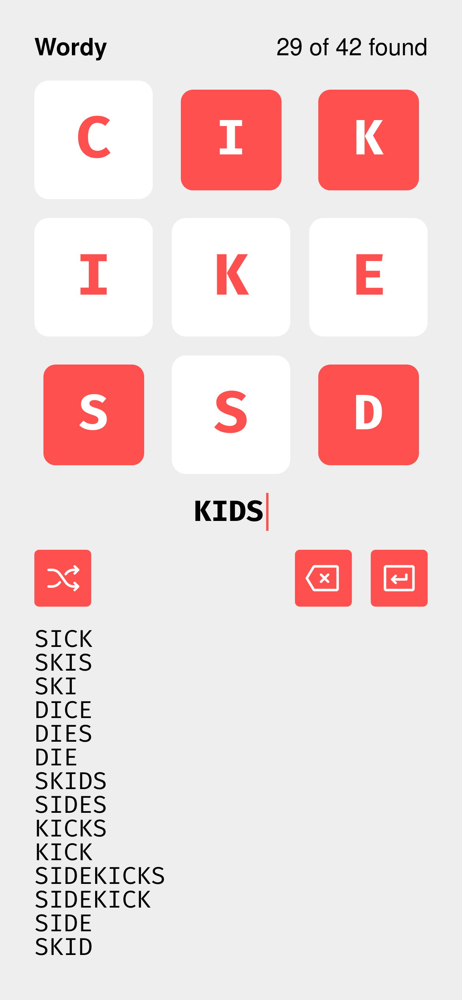

# Wordy

Wordy is a clone of an iOS game called [Worder](https://itunes.apple.com/us/app/worder/id295069415?mt=8), but written in Elm.

The objective is to spell as many words as possible using the nine given letters.

Each word must be three letters or longer (later, this will be configurable at runtime!).

You can use the keyboard to enter guesses or click on the big letters.

**[Play Wordy](https://adamdicarlo.com/elm-wordy/)**

## Running locally

This project uses [devenv](https://devenv.sh/), which means it should run locally for you with no problem; you don't need Elm, Node.js, or anything installed.

1. Clone this repository
1. Install [devenv](https://devenv.sh/getting-started/)
1. Enter a devenv shell:
   ```bash
      devenv shell
   ```
4. Run `npm start`
1. Open up [http://localhost:2345/](http://localhost:2345/) in your browser.


